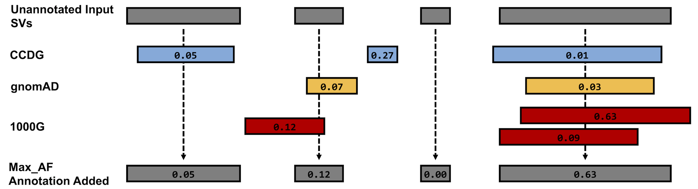
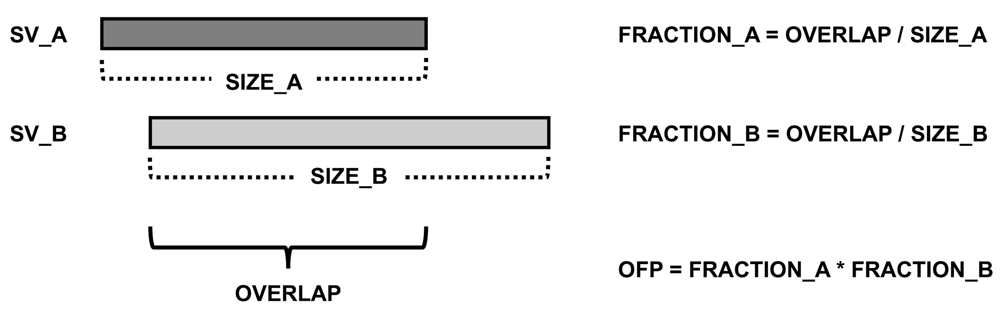
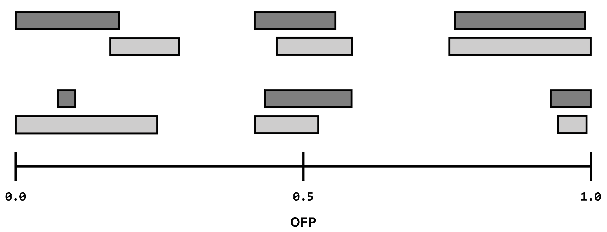
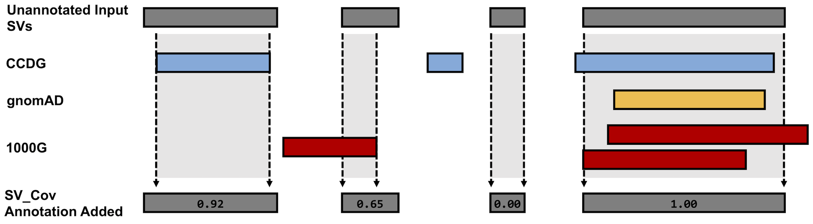
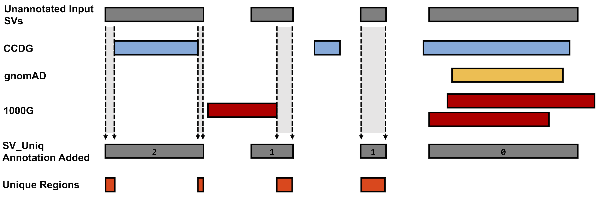

# SVAFotate (CPG fork)

**Structural Variant Allele Frequency annotator.** Annotates a structural-variant VCF with population
allele frequencies and related metrics from one or more population SV callsets (gnomAD-SV, CCDG,
1000 Genomes, TOPMed) supplied as a single BED file.

This is the [Centre for Population Genomics](https://populationgenomics.org.au) fork of
[fakedrtom/SVAFotate](https://github.com/fakedrtom/SVAFotate). It exists so the tool can run on current
Python (3.10+), and numpy >=2: upstream depends on pyranges 0.1.4, which fails on pandas 3
(`Unknown dtype str in a column SVTYPE`) and pulls in C extensions that ship no wheels, complicating
the installation. The interval matching has been re-implemented in numpy; the command line and the
annotations are unchanged, and a golden regression suite checks the output against upstream. See [Differences from upstream](#differences-from-upstream).

Please continue to cite the [SVAFotate publication](https://doi.org/10.1186/s12859-022-05008-y) when using this tool.

## Installation

Requires Python 3.10 or newer. The only runtime dependencies are `cyvcf2` and `numpy`, both broadly available as wheels.

```bash
uv pip install git+https://github.com/MattWellie/svafotate        # or: pip install git+...
svafotate --version
```

A `Dockerfile` is included: `docker build -t svafotate_cpg .` produces an image whose entrypoint is
`svafotate`.

## Usage

```
svafotate annotate -v in.vcf.gz -o out.vcf -b SVAFotate_core_SV_popAFs.GRCh38.v4.1.bed.gz
```

### Required arguments

| Flag          | Meaning                                                                                                               |
|---------------|-----------------------------------------------------------------------------------------------------------------------|
| `-v`, `--vcf` | Input SV VCF (`.vcf`, `.vcf.gz` or `.bcf`). Each record needs an `ID`, an `SVTYPE`, and `END` and/or `SVLEN` in INFO. |
| `-o`, `--out` | Output path.                                                                                                          |
| `-b`, `--bed` | Reference BED of population SVs (see [The reference BED](#the-reference-bed)).                                        |

### Optional arguments

| Flag                          | Meaning                                                                                                                                                                                                                   |
|-------------------------------|---------------------------------------------------------------------------------------------------------------------------------------------------------------------------------------------------------------------------|
| `-f`, `--minf`                | Minimum reciprocal overlap fraction(s), 0-1. One value applies to every source; several values pair up with the sources given to `-s`. **Default 0.001, which accepts almost any overlap; 0.5 or higher is recommended.** |
| `-s`, `--sources`             | Sources (values of the BED `SOURCE` column) to use. Default: all sources in the BED.                                                                                                                                      |
| `-a`, `--ann`                 | Extra annotations: `mf`, `best`, `pops`, any single population (`AFR AMI AMR ASJ EAS EUR FIN MID NFE OTH SAS`), `full`, `mis`, or `all`.                                                                                  |
| `-c`, `--cov`                 | Add `SV_Cov` (fraction of the SV covered by same-type reference SVs). Takes a minimum reference AF.                                                                                                                       |
| `-u`, `--uniq`                | Add `SV_Uniq` and write a BED of regions within each SV never observed with the same SVTYPE. Takes a minimum reference AF.                                                                                                |
| `--uniq-out`                  | Where `-u` writes its BED. Default `uniques.bed` in the working directory.                                                                                                                                                |
| `-l`, `--lim`                 | With `-c`/`-u`: ignore reference SVs larger than this many bases.                                                                                                                                                         |
| `-t`, `--target`              | BED of `CHROM START END ID` regions; adds `Target_Overlaps` (and `Unique_Targets` with `-u`).                                                                                                                             |
| `-ci`, `-ci95`                | Use `CIPOS`/`CIEND` (or the `95` variants) to shrink (`in`) or grow (`out`) each SV before matching. Every record must carry the fields.                                                                                  |
| `-e`, `--emb` / `-r`, `--red` | Grow or shrink every SV by a fixed number of bases.                                                                                                                                                                       |
| `--ins`                       | Extend insertion coordinates to `START + SVLEN` when computing overlap fractions, so `-f` and `best` apply to insertions.                                                                                                 |
| `-O`, `--out_type`            | `vcf` (default), `vcfgz`, `bcf`, `bcfgz`.                                                                                                                                                                                 |
| `--cpu`                       | Threads for htslib reading/writing. Nothing else is parallel.                                                                                                                                                             |
| `-q`, `--quiet`               | Log only warnings and errors (goes before `annotate`).                                                                                                                                                                    |

### Default annotations

Matching SVs are reference SVs with the same `SVTYPE` that overlap the query SV on the same contig and
clear the `-f` reciprocal overlap threshold. `chr` prefixes are stripped from both files before comparing.

| INFO field              | Meaning                                                                            |
|-------------------------|------------------------------------------------------------------------------------|
| `Max_AF`                | Highest AF among all matches, across the selected sources (0 when there are none). |
| `Max_Het`, `Max_HomAlt` | Highest heterozygous / homozygous-alt genotype counts among matches.               |
| `Max_PopMax_AF`         | Highest population-maximum AF among matches.                                       |
| `<source>_Count`        | Number of matches from each source.                                                |

Each `Max_*` is computed independently, so they may come from different reference SVs.



### Extra annotations (`-a`)

- **`mf`** adds `Max_Male_*` and `Max_Female_*` for AF, Het and HomAlt.
- **`pops`** (or a single population code) adds `Max_<POP>_AF`, `Max_<POP>_Het`, `Max_<POP>_HomAlt`; combined
  with `mf`, also `Max_<POP>_Male_*` / `Max_<POP>_Female_*`.
- **`best`** adds, per source, the single best-matching reference SV: `Best_<source>_ID`, `Best_<source>_OFP`,
  and `Best_<source>_<column>` for every column the `Max_*` set covers. *Best* is the match with the
  highest **overlap fraction product** (OFP), the product of the two reciprocal overlap fractions. Ties go
  to the higher AF, then the higher HomAlt count. **The best match is chosen among all overlaps, not only
  those passing `-f`**, so check `<source>_Count > 0` before trusting it.

   
- **`mis`** reports overlapping reference SVs of a *different* SVTYPE that pass `-f`: `<source>_Mismatches`,
  `<source>_Mismatches_Count`, `<source>_Mismatch_SVTYPEs`, and the best mismatch
  (`Best_<source>_Mismatch_ID/OFP/SVTYPE/AF/Het/HomAlt`).
- **`full`** adds `<source>_Matches`: every matching reference row verbatim as
  `SV_ID|SVTYPE|<all value columns>`, comma-separated. Large.
- **`all`** turns on everything above.

### Coverage and unique regions (`-c`, `-u`, `-l`, `-t`)

`SV_Cov` is the fraction of the query SV covered by the union of same-SVTYPE reference SVs whose AF
exceeds the value given to `-c`; `<source>_SV_Cov` is the same per source. `-u` finds the parts of each
query SV not covered by any such reference SV, counts them in `SV_Uniq`, and writes them to a BED with
the het and hom-alt sample names for that SV. Both ignore `-f`. `-l` excludes very large reference SVs
(CCDG reports a 61 Mb deletion) that would otherwise cover everything.

 

## The reference BED

The curated file `SVAFotate_core_SV_popAFs.GRCh38.v4.1.bed.gz` (gnomAD-SV v4.1, CCDG, 1000G, TOPMed;
GRCh38; Ensembl-style contig names) is on [Zenodo](https://zenodo.org/records/11642574). Any tab-separated
file with a `#`-prefixed header works provided the first seven columns are
`CHROM START END SVLEN SVTYPE SOURCE SV_ID` and the value columns include at least `AF`, `Het`, `HomAlt`
and `PopMax_AF` (plus whichever population / sex columns the requested `-a` options need; the tool tells
you if one is missing). Use `NA` for unavailable values.

Only rows for the sources you select with `-s` are loaded, and value columns are held as numeric arrays,
so the full four-source file fits comfortably in memory. If you only ever annotate against gnomAD, a
reduced copy is still faster to read:

```bash
gunzip -c SVAFotate_core_SV_popAFs.GRCh38.v4.1.bed.gz | awk -F'\t' 'NR == 1 || $6 == "gnomAD"' | gzip -c > gnomAD_only.bed.gz
```

## Differences from upstream

- **Dependencies**: `cyvcf2` and `numpy` only. pyranges, ncls, sorted-nearest and pandas are gone.
- **Contig names**: `chr` is stripped from the reference BED as well as the VCF. Upstream only stripped
  the VCF, so a `chr`-prefixed BED silently produced `Max_AF=0` everywhere.
- **`HomAlt_Samples`** in the `-u` BED is now populated (upstream compared against the wrong genotype code
  and always wrote `None`).
- **Best-match tiebreak** compares AF and HomAlt numerically (upstream compared the wrong columns, as strings).
- **Missing columns** in the reference BED produce a clear error before any work is done, instead of a
  `KeyError` while writing.
- **Records without `SVTYPE`** are annotated with zeros instead of crashing the run.
- `Best_<source>_Mismatch_OFP` is declared `Float` (upstream: `String`).
- The order of members in `<source>_Matches` / `<source>_Mismatches` follows reference start position.
- New options: `--uniq-out`, `--quiet`.
- The `pickle-source` and `custom-annotation` subcommands are gone.
- One upstream quirk is kept deliberately for output compatibility: when a record has `SVLEN` but no
  `END`, the end is `START + |SVLEN| + 1`.

## Acknowledgements

SVAFotate was written by Thomas Nicholas (fakedrtom) with contributions from Michael Cormier. This fork
only changes the implementation; the method and the reference data are theirs. The [original SVAFotate repository](https://github.com/fakedrtom/SVAFotate)
contains a directory of data relevant to the published manuscript - this has not been cloned into this tool-only version.
